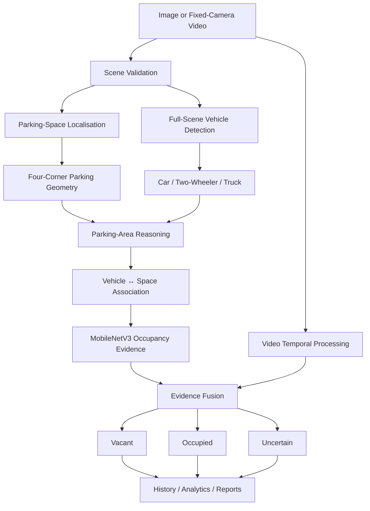
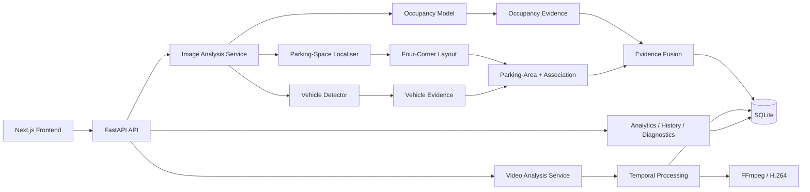

# Artificial Intelligence Based Smart Parking System

<p align="center">
  <strong>Computer-vision parking intelligence for images and fixed-camera video</strong>
</p>

<p align="center">
  Automatically localises parking spaces, estimates occupancy, detects supported vehicle classes,
  analyses fixed-camera video, and preserves auditable results through history, analytics,
  diagnostics, and reports.
</p>

<p align="center">
  
  
  
  
  
  
</p>

---

## Project Overview

The **Artificial Intelligence Based Smart Parking System** is a computer-vision platform for analysing parking-lot images and prerecorded fixed-camera video.

The system goes beyond a simple occupied/vacant classifier. It combines:

- parking-space localisation
- four-corner perspective-aware parking geometry
- per-space occupancy inference
- full-scene vehicle detection
- parking-area reasoning
- vehicle-to-space association
- confidence-aware evidence fusion
- automatic fixed-camera layout calibration
- camera-drift detection and revalidation
- temporal processing for video
- analytics, history, diagnostics, and reporting

The project is designed around an important product principle:

> **If the system cannot determine parking geometry reliably, it should abstain instead of fabricating a layout.**

---

## Motivation

Drivers often spend unnecessary time searching for available parking while many parking facilities still depend on manual monitoring or per-space hardware.

Sensor-based parking systems can require additional installation, wiring, maintenance, and cost for every parking bay. A camera-based approach can instead use visual information already available from parking-lot imagery or fixed CCTV-style viewpoints.

This project explores that approach while focusing on four engineering problems:

1. **Where are the parking spaces?**
2. **Which spaces are vacant, occupied, or uncertain?**
3. **Which supported vehicles are visible across the parking facility?**
4. **Can the system remain reliable when the camera, weather, perspective, or parking layout changes?**

---

## Core Product Capabilities

### Automatic parking-space localisation

The system can localise known fixed-camera layouts and can also propose geometry for unfamiliar parking views.

The latest product pipeline uses **four independently predicted parking-space corners** rather than relying only on oriented rectangles. This better represents:

- straight parking bays
- diagonal parking
- slanted spaces
- perspective distortion
- trapezoidal image-plane projections
- different camera heights and viewing angles

### Three-state occupancy intelligence

Every resolved space is reported as:

- **Vacant**
- **Occupied**
- **Uncertain**

Low-confidence cases are not automatically forced into a binary decision.

### Full-scene vehicle understanding

The product exposes only three supported vehicle classes:

| Product class | Includes |
| --- | --- |
| **Car** | passenger cars, large cars, SUVs, vans |
| **Two-wheeler** | motorcycles, bikes, scooters |
| **Truck** | trucks / lorries / supported truck-like vehicles |

Unsupported vehicle-shaped detections can still contribute internally to occupancy evidence, but they are **not exposed as a fourth product class**.

### Parking-area reasoning

Full-scene vehicle detection is separated into operational context:

- vehicles associated with mapped parking spaces
- vehicles inside the inferred parking area but not associated with a mapped space
- vehicles outside the parking area / off-site scene traffic

This prevents nearby road traffic from automatically inflating parking-facility metrics.

### Automatic fixed-camera calibration

For fixed-camera operation, the system can use multiple stable frames to establish a reusable parking layout.

The intended lifecycle is:

```text
New camera
   ↓
Detect candidate spaces across stable frames
   ↓
Cluster recurring geometry
   ↓
Reject transient detections
   ↓
Establish stable layout
   ↓
Reuse layout for future frames
   ↓
Periodically revalidate
   ↓
Recalibrate if camera drift is detected
```

### Safe abstention

The normal product workflow is AI-driven and does not require a user to manually draw parking polygons.

When the scene cannot be resolved reliably, the system can return states such as:

```text
AUTOMATIC_LAYOUT_UNRESOLVED
INSUFFICIENT_VISUAL_EVIDENCE
RECALIBRATING
```

rather than confidently returning incorrect geometry.

### Fixed-camera video intelligence

The video pipeline supports:

- MP4 and AVI input
- stable-layout reuse
- camera-stability checks
- temporal occupancy confirmation
- progress reporting
- cancellation
- duplicate-job protection
- H.264 browser-compatible output
- synchronized playback metrics
- occupancy timelines
- per-space changes/events
- Vacant + Occupied + Uncertain accounting

### Product analytics

Every completed analysis can feed:

- local analysis history
- occupancy analytics
- dataset comparisons
- model confidence views
- system diagnostics
- downloadable reports
- model/readiness status

---

## Benchmark Mode vs Product Mode

The project intentionally separates scientific evaluation from real-world product behaviour.

### Benchmark Mode

Benchmark Mode uses exactly the parking spaces defined by the source dataset.

It is used for:

- reproducible evaluation
- ground-truth agreement
- protected holdout reporting
- per-dataset comparisons
- regression testing

If a benchmark image visually contains additional vehicles or spaces outside the labelled benchmark region, they are **not added to the benchmark denominator**.

### Product Mode

Product Mode attempts to understand the full visible parking scene.

It can:

- detect plausible parking spaces beyond a benchmark subset
- detect supported vehicles across the complete scene
- distinguish in-space, in-area-unmapped, and off-site vehicles
- use multiple AI signals for occupancy
- abstain when geometry is not trustworthy

This distinction prevents product-oriented scene understanding from corrupting benchmark methodology.

---

## How the AI Pipeline Works



---

## Parking-Space Geometry Evolution

An important finding during development was that an **oriented bounding box is still fundamentally a rectangle**.

A real parking bay may be rectangular on the ground plane, but perspective projection can turn it into a general quadrilateral in the image.

The project therefore evaluated several localisation representations:

- rotated / oriented bounding boxes
- four-corner keypoint / pose prediction
- instance segmentation converted back to quadrilateral geometry
- Keypoint R-CNN

### Selected deployment architecture

The current deployment choice is **YOLO11n-pose with four independent parking-space corners**.

It was selected as the best current balance between:

- perspective-aware geometry
- strict-IoU performance
- model size
- CPU deployment latency
- ONNX exportability
- compatibility with the existing application

### Measured geometry comparison

On the perspective-heavy ACPDS evaluation subset, using deployed-path inference:

| Candidate | ACPDS Recall@50 | ACPDS Recall@75 | Precision@50 | Polygon IoU | Corner Error |
| --- | ---: | ---: | ---: | ---: | ---: |
| OBB incumbent | **0.566** | 0.103 | 0.604 | 0.588 | 0.373 |
| **Four-corner pose** | 0.507 | **0.144** | **0.678** | **0.638** | **0.260** |
| Segmentation | 0.273 | 0.085 | 0.213 | 0.452 | 0.830 |
| Keypoint R-CNN | 0.542 | **0.340** | 0.591 | **0.667** | **0.203** |

Keypoint R-CNN produced the strongest geometry, but its CPU deployment cost was substantially higher: approximately **5.7 s** and **236 MB**, versus the much smaller pose deployment artifact. It is retained as an important measured upper-bound candidate for future GPU-backed product deployment.

---

## Occupancy Intelligence

The occupancy path uses a **MobileNetV3-Small** classifier together with additional evidence from the scene.

Signals can include:

- slot-level occupancy probability
- vehicle presence
- vehicle-to-slot overlap
- parking-space geometry confidence
- temporal history for video
- previous stable occupancy state

This reduces dependence on any one model.

A supported vehicle detector is **not used as a hard gate**. If a space contains an unsupported or misclassified object but the occupancy evidence is strong, the slot can still be reported as **Occupied** or **Uncertain** instead of incorrectly being forced to Vacant.

### Protected occupancy result

The preserved protected holdout result for the occupancy model remains:

| Metric | Result |
| --- | ---: |
| Accuracy | **97.91%** |
| Balanced accuracy | **97.91%** |
| Occupied precision | **96.65%** |
| Occupied recall | **99.25%** |
| F1 score | **97.93%** |
| Vacant specificity | **96.56%** |
| False-vacant rate | **0.75%** |

Historical benchmark results are preserved for provenance rather than silently rewritten after later dataset-quality discoveries.

---

## Vehicle Detection and Classification

A dedicated full-scene vehicle detector complements parking-space localisation.

The current vehicle operating point was chosen with emphasis on **vehicle recall**, because missing a real vehicle can create dangerous false-vacant conclusions.

At the selected development operating point, vehicle detection achieved approximately:

- **98.5% precision** inside adjudicable parking bays
- **0.267 false detections per image**
- approximately **90%+ occupied-bay vehicle recall** at the selected high-resolution operating point

### General-domain class validation

A separate COCO-based development validation was used only for vehicle-class evidence and was kept outside the parking benchmark protocol.

| Class | Precision | Recall | F1 |
| --- | ---: | ---: | ---: |
| Car | 0.675 | 0.603 | 0.637 |
| Two-wheeler | 0.635 | 0.550 | 0.590 |
| Truck | 0.506 | 0.411 | 0.453 |

**Important:** Two-wheeler support is implemented, but parking-specific validation for scooters/motorcycles under steep CCTV viewpoints is still limited by available data. The project therefore does not claim production-grade two-wheeler validation yet.

---

## Parking-Area and Vehicle-to-Space Reasoning

Vehicle detection and occupancy are not treated as the same problem.

The system explicitly reasons about whether a vehicle is:

1. associated with a known parking space
2. inside the inferred parking facility but not mapped to a space
3. outside the parking facility

The second category can reveal incomplete geometry, double parking, aisle obstruction, or other non-standard parking behaviour without automatically labelling it as illegal parking.

---

## Automatic Camera Calibration

The project includes multi-frame layout consensus for fixed-camera onboarding.

In development testing on chronological fixed-camera imagery, the calibration procedure recovered approximately **90.2% of spaces between disjoint frame groups at IoU 0.5**, with a **median polygon IoU of 0.941**.

Once a stable layout is established, the system can reuse it instead of rerunning expensive localisation on every frame.

Camera drift is monitored so a moved or significantly changed camera can trigger revalidation rather than continuing with stale geometry.

---

## Datasets

The project uses three approved parking datasets.

### PKLot

A large parking occupancy dataset containing fixed-camera parking imagery across multiple sites, dates, weather conditions, and occupancy levels.

### CNRPark+EXT

A multi-camera parking dataset used for fixed-camera generalisation and occupancy evaluation.

### ACPDS

A perspective-heavy parking dataset that is especially useful for evaluating geometry under wide-angle, oblique, and non-axis-aligned viewpoints.

### Prepared project catalogue

The prepared demonstration catalogue contains:

- **30 image scenarios**
  - 10 PKLot
  - 10 CNRPark+EXT
  - 10 ACPDS
- **1,529 prepared scenario slots**
- **6 fixed-camera time-lapse sequences**
  - 3 PKLot
  - 3 CNRPark+EXT

The full occupancy preparation protocol contains more than **100,000 slot samples** and keeps model-development partitions separate from protected reporting partitions.

---

## Dataset Quality Findings

A major part of the project was validating the labels rather than assuming every source annotation was correct.

One important PKLot finding was that several PUCPR date groups contained XML records with missing occupancy attributes. Earlier parsing logic could silently interpret missing occupancy as vacant.

The current data pipeline instead treats missing or invalid occupancy labels as invalid/quarantined data rather than silently converting them to a class.

Another geometry finding was that dataset annotations are not equally suitable for precise boundary learning:

- ACPDS preserves useful perspective-aware quadrilateral geometry
- CNRPark+EXT annotations are largely axis-aligned rectangles
- some PKLot polygons describe where vehicles stand rather than perfectly following painted bay boundaries

For this reason, the project distinguishes **dataset geometry agreement** from **product geometry quality**.

---

## Evaluation Methodology

The project follows a controlled evaluation workflow:

```text
Raw datasets
   ↓
Integrity validation
   ↓
Prepared development partitions
   ↓
Train / validation / unseen-camera development
   ↓
Model selection
   ↓
Protected final reporting
```

Key rules:

- protected holdout data is not used for model selection
- benchmark-defined spaces are not silently expanded
- prepared scenarios are treated as exposed evidence rather than selection data
- historical results remain preserved for provenance
- new models are compared with consistent geometry metrics

---

## Technology Stack

### Frontend

- **Next.js 16**
- **React**
- **TypeScript**
- responsive product UI

### Backend

- **Python 3.12 / 3.13**
- **FastAPI**
- **Pydantic**
- **SQLite**

### AI / Computer Vision

- **PyTorch** for model development and training
- **ONNX Runtime** for deployment inference
- **OpenCV**
- **MobileNetV3-Small** occupancy model
- **YOLO11n-pose** four-corner parking-space localisation
- dedicated full-scene vehicle detection
- geometric and temporal fusion logic

### Media

- **FFmpeg**
- H.264 output generation
- browser Range-request playback support

### Development

- Git / GitHub
- PowerShell automation
- pytest
- Ruff
- frontend lint/typecheck/build validation

---

## System Architecture



---

## Project Structure

```text
Artificial-Intelligence-Based-Smart-Parking-System-/
├── backend/
│   ├── app/
│   │   ├── api/                # FastAPI routes
│   │   ├── core/               # Configuration
│   │   ├── datasets/           # Dataset parsing / integrity / preparation
│   │   ├── db/                 # SQLite models and migrations
│   │   ├── ml/                 # Localisation, occupancy, geometry, inference
│   │   └── services/           # Analysis, analytics, reliability, video
│   └── tests/                  # Backend regression tests
├── frontend/
│   └── src/
│       ├── app/                # Next.js routes
│       ├── components/         # Product UI
│       └── lib/                # Frontend utilities and demo data
├── ml/                         # Training / evaluation / export tooling
├── scripts/                    # Setup, startup and verification scripts
├── docs/                       # Architecture and implementation documentation
├── .env.example
└── README.md
```

---

## Prerequisites

- Windows 10 or 11
- Git
- Python 3.12 or 3.13
- Node.js 22
- npm
- FFmpeg for video processing
- NVIDIA GPU recommended for model development/training
- CPU-compatible inference for the current local deployment

The project keeps its large datasets and model artifacts outside Git.

---

## Local Setup

### 1. Clone the repository

```powershell
git clone https://github.com/harshawardhanchitnis/Artificial-Intelligence-Based-Smart-Parking-System-.git
cd Artificial-Intelligence-Based-Smart-Parking-System-
```

### 2. Configure the environment

```powershell
Copy-Item -LiteralPath '.env.example' -Destination '.env'
```

Set the external data root in `.env`.

Example:

```env
APP_ENV=development
APP_HOST=127.0.0.1
APP_PORT=8000
PARKING_DATA_ROOT=D:/Projects/AI Based Smart Parking System Data
CORS_ORIGINS=http://localhost:3000,http://127.0.0.1:3000
NEXT_PUBLIC_API_BASE_URL=http://127.0.0.1:8000/api/v1
```

### 3. Run first-time setup

```powershell
powershell -ExecutionPolicy Bypass -File '.\scripts\setup.ps1'
```

The setup creates the backend virtual environment, installs dependencies, initializes the local database, and validates required project resources.

---

## Start the Application

Open two PowerShell terminals in the repository root.

### Backend

```powershell
powershell -ExecutionPolicy Bypass -File '.\scripts\start-backend.ps1'
```

Backend:

```text
http://127.0.0.1:8000
```

API documentation:

```text
http://127.0.0.1:8000/docs
```

### Frontend

```powershell
powershell -ExecutionPolicy Bypass -File '.\scripts\start-frontend.ps1'
```

Frontend:

```text
http://localhost:3000
```

---

## Main Product Areas

The frontend provides dedicated workflows for:

- **Dashboard**
- **Presentation / guided demo**
- **Analyse images**
- **Analyse video**
- **Parking lots / layouts**
- **History**
- **Analytics**
- **AI diagnostics**
- **Reports**
- **System readiness**

---

## Verification

The current integrated verification includes:

- backend unit/regression tests
- dataset and model integrity checks
- API route checks
- readiness checks
- frontend lint
- TypeScript validation
- production build
- video playback validation
- H.264 output verification
- duplicate video-job protection
- occupancy accounting checks
- known-camera and unseen-camera regression coverage

Latest integrated verification reached:

- **173 backend tests passing**
- **13/13 system-readiness checks**
- **17 API endpoints healthy**
- **13 frontend routes rendering**
- frontend lint/typecheck/build passing

---

## Data and Artifact Policy

Large runtime assets are intentionally excluded from Git, including:

- original dataset archives
- extracted dataset images
- prepared benchmark data
- generated media
- uploaded images/videos
- SQLite runtime databases
- Python virtual environments
- frontend dependency/build directories
- model weights
- training checkpoints
- ONNX artifacts where managed externally
- training state and large reports

The repository is intended to contain source code, tests, scripts, and documentation rather than multi-gigabyte datasets or model-training output.

---

## Privacy and Deployment Model

The current application is designed as a **local-first research/product prototype**.

Images, videos, database records, and model inference can remain on the machine running the application.

The architecture is also suitable for a future cloud product, where the major production migrations would be:

- SQLite → PostgreSQL
- local media → object storage
- local jobs → Redis / worker queue
- local-only API → secured cloud FastAPI deployment
- single-user state → authenticated organizations / parking sites / cameras
- CPU inference → scalable CPU/GPU workers

The UI and documentation therefore avoid treating local-only deployment as the permanent product boundary.

---

## Current Scope

### Supported today

- still-image parking analysis
- prerecorded fixed-camera video
- known-camera layout reuse
- generalized unseen-view parking-space proposals
- perspective-aware four-corner geometry
- Vacant / Occupied / Uncertain occupancy
- full-scene Car / Two-wheeler / Truck detection
- parking-area vehicle reasoning
- temporal video processing
- automatic layout calibration logic
- history, analytics, diagnostics, reports

### Not claimed yet

- production live RTSP/CCTV ingestion
- moving-camera / dashcam support
- production-grade two-wheeler parking validation
- cloud multi-tenant SaaS deployment
- real-time city-scale parking orchestration

---

## Known Limitations

- Generalized parking-space recall still depends heavily on camera and dataset diversity.
- Geometry-faithful datasets are much less abundant than simple rectangular parking labels.
- Two-wheeler support has general-domain validation, but parking-specific validation remains limited.
- Some steep top-down views can cause vehicle-class confusion even when occupancy evidence remains useful.
- Automatic calibration has strong development evidence, but a truly new unregistered-camera end-to-end video benchmark remains limited.
- The current deployment is CPU-oriented; heavier geometry models such as Keypoint R-CNN are more accurate but significantly slower without GPU serving.
- Live CCTV ingestion and production cloud scaling are future product stages.

---

## Product Roadmap

### Phase 1 — Current local intelligent application

- image analysis
- video analysis
- automatic parking-space geometry
- occupancy fusion
- vehicle intelligence
- analytics and diagnostics

### Phase 2 — Production cloud foundation

- Dockerized FastAPI services
- PostgreSQL
- object storage
- background worker queue
- authentication and organizations
- deployment monitoring

### Phase 3 — Parking-site product

- site/camera onboarding
- automatic camera calibration
- verified layout versioning
- scheduled revalidation
- operational dashboards

### Phase 4 — Live camera integration

- RTSP / IP camera support
- continuous frame sampling
- real-time occupancy
- alerts and event streams

### Phase 5 — Scalable parking intelligence

- multiple sites
- GPU inference workers
- occupancy APIs
- historical forecasting
- operational alerts
- integration with navigation / parking applications

---

## Engineering Lessons

This project produced several important findings:

1. **High occupancy-classification accuracy is not enough if parking-space localisation is incomplete.**
2. **An OBB can detect a bay but still represent its perspective geometry poorly.**
3. **Vacant spaces are harder to detect than occupied spaces because vehicles are visually salient.**
4. **Vehicle detection and parking-space localisation solve different problems and should be fused rather than substituted for one another.**
5. **Benchmark correctness and full-scene product understanding must remain separate.**
6. **Dataset-label quality can matter as much as model architecture.**
7. **Safe abstention is preferable to fabricated confidence.**
8. **A stronger model is not automatically the best product model if deployment latency and size are unacceptable.**

---

## Future Research

Future model work can explore:

- larger and more diverse geometry-faithful parking datasets
- improved corner/keypoint architectures
- GPU-backed Keypoint R-CNN or transformer-based calibration
- parking-area semantic segmentation
- stronger two-wheeler datasets
- multi-frame geometry learning
- camera-specific continual revalidation
- vehicle tracking and parking-event understanding
- live RTSP evaluation

---

## Conclusion

The **Artificial Intelligence Based Smart Parking System** has evolved from a dataset-driven occupancy prototype into a broader parking-intelligence platform that combines parking-space geometry, occupancy estimation, vehicle understanding, parking-area reasoning, fixed-camera calibration, temporal video processing, and auditable analytics.

The project deliberately separates scientific benchmark evaluation from product-mode scene understanding and prefers safe uncertainty over fabricated results.

Its current local-first architecture provides a strong foundation for the next stage: a cloud-hosted, multi-site parking-intelligence product with live fixed-camera integration.

---

## Author

**Harshawardhan Chitnis**

- GitHub: [@harshawardhanchitnis](https://github.com/harshawardhanchitnis)
- Portfolio: [harshawardhanchitnis.github.io](https://harshawardhanchitnis.github.io/)
- LinkedIn: [Harshawardhan Chitnis](https://www.linkedin.com/in/harshawardhanchitnis/)

---

> **Note:** Model-training artifacts, datasets, prepared media, and large runtime assets are intentionally kept outside the Git repository. The repository focuses on reproducible source code, tests, scripts, and project documentation.
